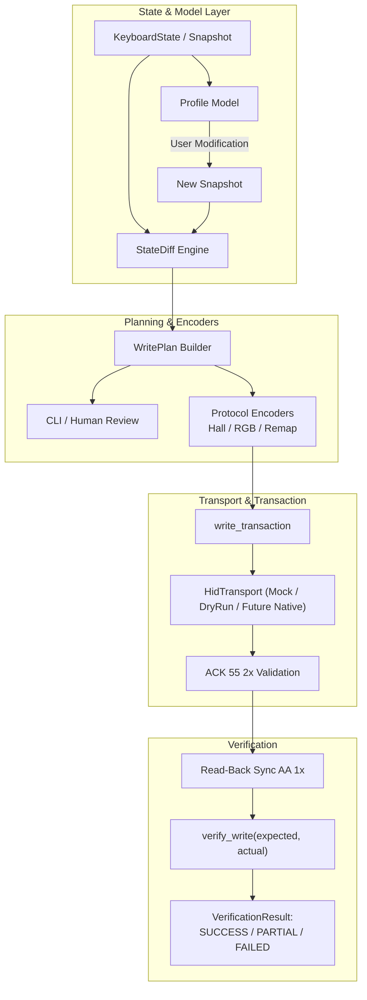

# KeyboardSoft System Architecture

Architecture documentation for the **IO by Red Square Type 84 Magnetic Black** (VID `0x0C45`, PID `0x80D6`) reverse-engineering, state synchronization, and configuration pipeline.

---

## 1. Overview & Pipeline Philosophy

The software is structured with a strict unidirectional write and verification pipeline. At no point does the application perform uninspected or uncontrolled writes to hardware.



### End-to-End Flow
1. **Keyboard State / Snapshot**: Represents the current known state of the keyboard across all parameters.
2. **Profile Model**: High-level semantic representation of settings (Hall actuation & RT per key, RGB global/per-key, Key Remap L1/L2, Fn layer, Macro, Calibration).
3. **Modify Parameter**: User or configuration script updates a parameter on a target profile.
4. **State Diff**: Pure functional diff engine compares pre- and post-snapshots, computing minimal altered domains.
5. **Write Plan**: Generates human-readable inspection plan, packet sequences, and payload summaries.
6. **HID Transport**: Abstract transport layer. In development and testing, `MockHidTransport` or `DryRunTransport` are enforced.
7. **ACK Validation**: Every write report requires immediate opcode matching ACK (`55 2x`) from device.
8. **READ-BACK**: Following writes, a fresh read cycle (`AA 1x` requests) fetches live state from the hardware.
9. **Verification**: `verify_write` verifies byte-level and semantic convergence between expected state and read-back state.

---

## 2. Layer Architecture

```text
               +-------------------------------------------+
               |             Hardware Keyboard             |
               |        VID 0x0C45 / PID 0x80D6            |
               +-------------------------------------------+
                                     │ (USB HID 64B Reports)
                                     ▼
               +-------------------------------------------+
               |              Transport Layer              |
               |  - HidTransport Protocol                  |
               |  - DryRunTransport (zero side-effects)    |
               |  - MockHidTransport (in-memory simulator) |
               |  - [Future] NativeHidTransport (hidapi)   |
               +-------------------------------------------+
                                     │
               +─────────────────────┴─────────────────────+
               │               Protocol Layer              │
               │                                           │
               │  [READ Parsers]        [WRITE Encoders]   │
               │  - DeviceInfo (10)     - Hall (27)        │
               │  - Status (11)         - RGB Global (23)  │
               │  - KeyRemap L1/L2 (12) - RGB PerKey (24)  │
               │  - FnLayer (13)        - Remap (22)       │
               │  - Macro (15)                             │
               │  - Hall 1/2 (17, 18)                      │
               │  - RGB Global (14)                        │
               │  - RGB PerKey (16)                        │
               │  - Calibration (1C)                       │
               │                                           │
               │  [Transaction & Safety]                   │
               │  - write_transaction(...)                 │
               │  - verify_write(...)                      │
               │  - build_write_plan(...)                  │
               +─────────────────────┬─────────────────────+
                                     │
               +─────────────────────┴─────────────────────+
               │                 Model Layer               │
               │  - KeyboardState / KeyboardSnapshot       │
               │  - KeyboardProfile & HallProfileState     │
               │  - RgbConfig & PerKeyLed                  │
               │  - KeyMap (84 physical keys)              │
               │  - StateDiff Engine (pure comparison)     │
               +─────────────────────┬─────────────────────+
                                     │
               +─────────────────────┴─────────────────────+
               │              Application Layer            │
               │  - CLI (read, inspect, diff, plan)        │
               │  - [Future] GUI / Web Configurator        │
               +-------------------------------------------+
```

---

## 3. Core Components

### 3.1 Model Layer (`src/keyboard_re/models/`)
- [`base.py`](file:///c:/KeyboardSoft/src/keyboard_re/models/base.py): Base types, physical keyboard layout `KEY_MAP` (84 keys indexed by row/col), raw report containers (`RawReport`, `RawCapture`).
- [`state.py`](file:///c:/KeyboardSoft/src/keyboard_re/models/state.py):
  - `KeyboardState`: Mutable state container integrating device info, status, profiles 1 and 2, calibration data, and macros.
  - `KeyboardSnapshot`: Immutable, frozen snapshot of keyboard configuration at a specific timestamp. Supports `.diff(other) -> StateDiff`.
  - `KeyboardProfile`: Profile-specific data (Hall triggers, RGB global settings, per-key RGB table, remap layers L1 & L2).
  - `HallProfileState`: Semantic per-key actuation (mm), RT press sensitivity (mm), RT release sensitivity (mm), and feature flags.

### 3.2 Protocol Layer (`src/keyboard_re/protocol/`)
- **Parsers**:
  - [`packets.py`](file:///c:/KeyboardSoft/src/keyboard_re/protocol/packets.py): Low-level 64-byte framing (`AA 1x`, `55 1x`, `AA 2x`, `55 2x`).
  - [`hall.py`](file:///c:/KeyboardSoft/src/keyboard_re/protocol/hall.py): 1008-byte Hall configuration parser and encoder (`build_hall_write`, `build_hall_terminator`).
  - [`rgb.py`](file:///c:/KeyboardSoft/src/keyboard_re/protocol/rgb.py): RGB global packet parser/encoder (`AA 23`) and 512-byte per-key LED buffer encoder (`AA 24`).
  - [`read_sync.py`](file:///c:/KeyboardSoft/src/keyboard_re/protocol/read_sync.py): Handshake orchestrator for sequential multi-chunk read operations.
- **Diff & Planning**:
  - [`diff.py`](file:///c:/KeyboardSoft/src/keyboard_re/protocol/diff.py): Functional difference engine returning `StateDiff` containing lists of changed keys, RGB differences, and remap slot changes.
  - [`plan.py`](file:///c:/KeyboardSoft/src/keyboard_re/protocol/plan.py): Translates high-level modifications or a `StateDiff` into an executable `WritePlan` with report counts, byte payloads, and safety warnings.
- **Transaction & Verification**:
  - [`transaction.py`](file:///c:/KeyboardSoft/src/keyboard_re/protocol/transaction.py): Implements `write_transaction()` (write $\to$ ACK receive $\to$ validation) and `verify_write()` (closed-loop verification comparing expected diff against fresh read-back).
- **Transport**:
  - [`transport.py`](file:///c:/KeyboardSoft/src/keyboard_re/protocol/transport.py): Abstract `HidTransport` protocol, `MockHidTransport` for unit testing with auto-ACK and simulated registers, and `DryRunTransport` for dry-run CLI execution.

---

## 4. Safety Invariants & Rules

> [!IMPORTANT]
> **Zero Hardware Write Invariant**: No native HID write backend (`hidapi`, `pyusb`, or Windows OS calls) is enabled. Writing to actual hardware is prohibited until the test harness and safety architecture are fully certified.

1. **Explicit Transport Selection**: All write transactions require an explicit `HidTransport` instance. Defaults always point to safe simulators.
2. **Every Write Requires Immediate ACK**: Every 64-byte write report sent to the keyboard must return a matching 64-byte ACK (`55 2x`) before the next report is dispatched.
3. **Multi-Packet Atomicity**: Multi-packet sequences (e.g. Hall 19 reports, RGB per-key 9 reports) must abort immediately if any intermediate report is rejected or times out.
4. **Closed-Loop Read-Back**: A write is never considered verified until a full read cycle (`AA 1x`) is executed and compared against the target model via `verify_write()`.
5. **No Blind CLI Writes**: The CLI contains commands for reading captures (`read`), inspecting decoded models (`inspect`), and generating dry-run plans (`plan`), but purposefully exposes **no direct write command**.

---

## 5. Directory Structure

```text
KeyboardSoft/
├── docs/
│   ├── ARCHITECTURE.md          # This file
│   ├── PROTOCOL.md              # 84-key physical mapping & Hall protocol
│   ├── RGB_PROTOCOL.md          # Global (AA 23) and Per-Key (AA 24) RGB
│   ├── READ_PROTOCOL.md         # Read handshake (AA 1x -> 55 1x)
│   ├── KEYMAP_PROTOCOL.md       # Remap layer & HID usage table
│   └── SEMANTIC_VERIFICATION.md # Empirical verification results
├── src/keyboard_re/
│   ├── cli.py                   # Safe inspection and dry-run planning CLI
│   ├── models/
│   │   ├── __init__.py          # Unified exports
│   │   ├── base.py              # KEY_MAP, RawCapture, RawReport
│   │   └── state.py             # KeyboardState, KeyboardSnapshot, Profiles
│   └── protocol/
│       ├── __init__.py
│       ├── packets.py           # Report framing & opcodes
│       ├── hall.py              # Hall table encode / decode
│       ├── rgb.py               # RGB global & per-key encode / decode
│       ├── read_sync.py         # Multi-report read engine
│       ├── diff.py              # State snapshot diff engine
│       ├── plan.py              # WritePlan builder
│       ├── transport.py         # HidTransport, MockHidTransport, DryRunTransport
│       └── transaction.py       # write_transaction & verify_write
└── tests/
    ├── test_packets.py
    ├── test_hall_profile.py
    ├── test_rgb_protocol.py
    ├── test_read_protocol.py
    ├── test_state_model.py
    ├── test_diff.py
    ├── test_transport.py
    ├── test_transaction.py
    └── test_plan.py
```
