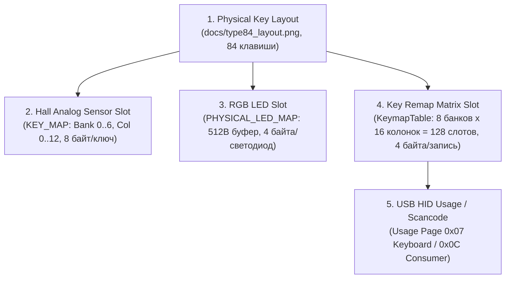

# Протокол переназначения клавиш (KEYMAP PROTOCOL) Type 84

> **Важное примечание по безопасности:**  
> Данная спецификация и связанные программные модули разработаны **исключительно для пассивного анализа** дампов трафика.  
> Прямая отправка команд записи (`AA 22`, `AA 26`, `AA 2C`) или изменения раскладки из Python **не производится**.

---

## 1. Архитектура матричных слоёв (Layer Architecture)

Веб-конфигуратор считывает три независимые таблицы переназначения клавиш, каждая из которых имеет фиксированный размер **512 байт (128 слотов по 4 байта)**:

1. **Layer 1 (Base / Default mapping):** Запрос `AA 12` $\to$ Ответ `55 12` (10 чанков). Базовый рабочий слой клавиатуры в режиме Windows.
2. **Layer 2 (Fn layer mapping):** Запрос `AA 16` $\to$ Ответ `55 16` (10 чанков). Слой комбинаций с зажатой клавишей `Fn`.
3. **Layer 3 (Alternate / Mac mapping):** Запрос `AA 1C` $\to$ Ответ `55 1C` (10 чанков). Альтернативный профиль раскладки (Mac-режим или альтернативный Fn-слой).

Каждая таблица передаётся последовательностью из 10 входящих отчётов:
- 9 отчётов по 56 байт (`sz = 0x38`) по адресам `0x0000`, `0x0038`, `0x0070`, ..., `0x01C0`.
- 1 хвостовой отчёт по 8 байт (`sz = 0x08`) по адресу `0x01F8` (504).

---

## 2. Разделение систем адресации (Addressing Systems)

В архитектуре клавиатуры Type 84 строго разделены **5 различных систем координат**:



| Система адресации | Объём / Диапазон | Шаг / Размер | Назначение |
|:---|:---:|:---:|:---|
| **Physical Layout** | 84 физические клавиши | Геометрические координаты | Физическое расположение клавиш на плате ANSI 75% |
| **Hall Matrix (`KEY_MAP`)** | 1008 байт (84 активных слота) | 8 байт (`bank * 128 + 5 + col * 8`) | Аналоговые пороги срабатывания и Rapid Trigger (`AA 27`/`AA 17`) |
| **RGB Matrix (`PHYSICAL_LED_MAP`)** | 512 байт (128 LED-слотов) | 4 байта (`slot * 4`, `[R, G, B, flags]`) | Поклавишная подсветка клавиш (`AA 24`/`AA 14`) |
| **Remap Matrix (`KeymapTable`)** | 512 байт (128 слотов) | 4 байта (`slot * 4`, `bank * 16 + col`) | Логическая таблица сканкодов контроллера (`AA 12`/`AA 16`) |
| **HID Usage ID** | `0x00` .. `0xE7` | 1-2 байта | Стандартные коды клавиш спецификации USB HID |

---

## 3. Формат записи клавиши (KeyRemapRecord)

Каждая запись таблицы занимает ровно **4 байта**:

```text
+----------+----------+----------+---------------+
|  Byte 0  |  Byte 1  |  Byte 2  |    Byte 3     |
|  Prefix  | Scancode | Special  | Function Type |
+----------+----------+----------+---------------+
```

### Назначение полей:
1. **`Byte 0` (Prefix / Extended Modifier):**
   - Обычно `0x00`.
   - В расширенных записях хранит префикс или флаг модификатора (например, `0x92`, `0x56`).
2. **`Byte 1` (Scancode):**
   - Стандартный USB HID Usage ID из таблицы **Keyboard/Keypad Page `0x07`**.
   - Примеры: `0x04` = 'A', `0x16` = 'S', `0x29` = 'Escape', `0x28` = 'Enter', `0x39` = 'CapsLock'.
   - Фирменный сканкод клавиши Fn: **`0xAF`**.
3. **`Byte 2` (Special / Secondary Code):**
   - Дополнительный код функции для аппаратных и мультимедийных комбинаций.
   - Используется на слое `Fn` (Layer 2): например, стрелки `Left` (`0x10`), `Down` (`0x0E`), `Up` (`0x0D`), `Right` (`0x0F`) для управления подсветкой.
4. **`Byte 3` (Function Type):**
   - `0x02` = **Standard Keyboard HID Key** (обычная клавиша клавиатуры).
   - `0x03` = **Extended System Key** (системная клавиша / кейпад, например PageDown `0x4E`, KPEnter `0x58`).
   - `0x0D` = **Hardware / Media / RGB Shortcut** (аппаратная функция переключения эффекта/яркости/медиа).
   - `0x00` = **Unbound / Passthrough** (не привязана / сквозное нажатие базового слоя).

---

## 4. Карта матрицы Remap Layer 1 (`AA 12`)

Контроллер оперирует стандартной матрицей **8 банков $\times$ 16 колонок = 128 слотов**. В прошивке используется полноразмерная матричная сетка (содержащая слоты Numpad для унификации прошивки с 104-клавишными моделями).

### Зависимость между Hall Column и Remap Column:
Для основных буквенно-цифровых блоков обнаружена строгая закономерность:
$$\text{Remap Column} = \text{Hall Column} + 1$$
Колонка 0 матрицы Remap зарезервирована для Numpad / служебных линий.

### Сводная карта банков Layer 1:
* **Bank 0 (Function Row):**
  * `Col 1`: Escape (`0x29`)
  * `Col 2..13`: F1 (`0x3A`) .. F12 (`0x45`)
* **Bank 1 (Number Row):**
  * `Col 1`: Grave / Tilde `` `~ `` (`0x35`)
  * `Col 2..11`: '1' (`0x1E`) .. '0' (`0x27`)
  * `Col 13`: '=+' (`0x2E`)
  * `Col 14..15`: Матричные слоты NumLock (`0x53`), KPSlash (`0x54`)
* **Bank 2 (QWERTY Row):**
  * `Col 0`: KPAsterisk (`0x55`)
  * `Col 1`: Tab (`0x2B`)
  * `Col 2..9`: 'Q' (`0x14`) .. 'I' (`0x0C`)
  * `Col 11..13`: 'P' (`0x13`), '[{' (`0x2F`), ']}' (`0x30`)
* **Bank 3 (Home Row):**
  * `Col 1`: CapsLock (`0x39`)
  * `Col 2..7`: 'A' (`0x04`) .. 'H' (`0x0B`)
  * `Col 9..13`: 'K' (`0x0E`), 'L' (`0x0F`), ';:' (`0x33`), '\'"' (`0x34`), '\\|' (`0x31`)
* **Bank 4 (Shift Row):**
  * `Col 1`: LShift (`0xE1`)
  * `Col 2..5`: 'Z' (`0x1D`) .. 'V' (`0x19`)
  * `Col 7..13`: 'N' (`0x11`), 'M' (`0x10`), ',<' (`0x36`), '.>' (`0x37`), '/?' (`0x38`), RShift (`0xE5`), Enter (`0x28`)
* **Bank 5 (Bottom Row & Navigation):**
  * `Col 1..3`: LCtrl (`0xE0`), LGui (`0xE3`), LAlt (`0xE2`)
  * `Col 5..8`: RAlt (`0xE6`), Fn (`0xAF`), Menu (`0x65`), RCtrl (`0xE4`)
  * `Col 9..12`: LeftArrow (`0x50`), DownArrow (`0x51`), UpArrow (`0x52`), RightArrow (`0x4F`)
  * `Col 13`: Backspace (`0x2A`)
* **Bank 6 (Navigation Cluster & Extended):**
  * `Col 4..6`: PrintScreen (`0x46`), ScrollLock (`0x47`), RGui (`0xE7`)
  * `Col 7..13`: Pause (`0x48`), Insert (`0x49`), Home (`0x4A`), PageUp (`0x4B`), Delete (`0x4C`), End (`0x4D`), PageDown (`0x4E`)
* **Bank 7 (Terminator / Reserved):**
  * `Col 0..13`: `00 00 00 00` (пустые слоты).
  * `Col 14 (Slot 126)`: `00 01 00 00` — маркер активности таблицы (аналогично маркеру в конце RGB-буфера).

---

## 5. Слой комбинаций Fn (Layer 2, `AA 16`)

На слое `Fn` прошивка переопределяет поведение клавиш:
1. **Функциональный ряд F1..F12:**
   * В таблице `AA 16` слоты F1..F12 заполнены `00 00 00 00`. Это означает, что контроллер использует базовое поведение клавиш либо системный passthrough.
2. **Служебные переназначения:**
   * `Fn + Backspace` (Slot 93): переопределён на **ScrollLock** (`0x47`, type `0x02`).
   * `Fn + End` (Slot 108): переопределён на **Pause** (`0x48`, type `0x02`).
3. **Стрелки (RGB и аппаратное управление):**
   * `Fn + Left` (Slot 89): `special = 0x10`, `type = 0x0D` (смена направления/режима RGB).
   * `Fn + Down` (Slot 90): `special = 0x0E`, `type = 0x0D` (уменьшение яркости).
   * `Fn + Up` (Slot 91): `special = 0x0D`, `type = 0x0D` (увеличение яркости).
   * `Fn + Right` (Slot 92): `special = 0x0F`, `type = 0x02` (смена скорости/цвета).

---

## 6. Аппаратно подтверждённый протокол записи Remap L1 (`AA 22`)

В контролируемом эксперименте через официальный конфигуратор `web.io.vision` (переназначение `Key A -> B`, файл дампа [`captures/experiments/remap_write_a_to_b.json`](file:///c:/KeyboardSoft/captures/experiments/remap_write_a_to_b.json)) зафиксированы точные параметры WRITE-транзакции:

### 6.1. Параметры фрейминга
| Параметр | Значение | Статус | Примечание |
|:---|:---:|:---:|:---|
| **WRITE Opcode** | **`AA 22`** | **`CONFIRMED`** | Префикс хоста `0xAA`, код операции `0x22` |
| **Длина отчёта (Report Length)** | **64 байта** | **`CONFIRMED`** | Стандартный фиксированный размер USB HID OUTPUT report |
| **Report ID** | **`0`** | **`CONFIRMED`** | В WebHID вызов `sendReport(0, ...)`, в байтах репорта ID не передаётся |
| **Канал передачи (Interface)** | `0xFF68` / `0x0061` | **`CONFIRMED`** | Основной конфигурационный интерфейс устройства |
| **Количество чанков** | **10 чанков** | **`CONFIRMED`** | 9 чанков по 56 байт + 1 хвостовой чанк по 8 байт = 512 байт |
| **Порядок отправки** | Линейно возрастающий | **`CONFIRMED`** | Адреса `0, 56, 112, 168, 224, 280, 336, 392, 448, 504` |
| **Отдельный терминатор (Commit)** | **НЕТ** | **`CONFIRMED`** | Отдельного 11-го пакета нет; фиксация in-band в чанке #9 (`00 01 00 00`) |
| **Подтверждения (ACKs)** | **10 отчётов (`55 22`)** | **`CONFIRMED`** | На каждый чанк контроллер немедленно отвечает эхо-отчётом |
| **Тайминги между пакетами** | ~18..20 мс (ср. 19.1 мс) | **`CONFIRMED`** | Полная транзакция записи занимает 188.9 мс |

### 6.2. Структура чанка данных
```text
Байты:  0    1    2    3    4    5 .. (5 + len - 1)    (5 + len) .. 63
       AA   22   SZ   A_LO A_HI  [---- PAYLOAD ----]   00 00 00 ...
```
- `SZ`: размер полезной нагрузки (`0x38` = 56 байт для чанков 0..8; `0x08` = 8 байт для чанка 9).
- `A_LO`, `A_HI`: 16-битный адрес смещения в таблице в формате Little-Endian (`<H`).
- Неиспользованные байты до конца 64-байтового репорта заполняются нулями (`0x00`).

### 6.3. Формат подтверждения контроллера (ACK)
```text
Байты:  0    1    2    3    4    5 .. 63
       55   22   SZ   A_LO A_HI  [Эхо полезной нагрузки / нули]
```
На каждый отправленный чанк контроллер отвечает репортом типа `inputreport` с префиксом `0x55` и опкодом `0x22`.

### 6.4. Верификация семантики слота клавиши A
- Клавиша `A` расположена в **Slot 50** (Bank 3, Col 2 в Remap-матрице, смещение в буфере `0x00C8` = 200).
- Данный слот передаётся в **Чанке #3** (адрес `0x00A8` = 168, смещение внутри чанка `+32`).
- Базовое значение: `00 04 00 02` (USB HID Scancode `0x04` = 'A').
- Записанное значение: `00 05 00 02` (USB HID Scancode `0x05` = 'B').
- Байт `0x00C9` изменился с `0x04` на `0x05`. Изменение 100% подтверждено.
- Среди 84 физических клавиш раскладки ни одна другая клавиша не изменилась.
- После возврата `B -> A` аппаратный read-back показал нулевой diff относительно исходного состояния.

---

## 7. Классификация статусов исследования

| Элемент протокола | Статус | Основание |
|:---|:---:|:---|
| Формат 4-байтовой записи `[prefix, scancode, special, type]` | **`CONFIRMED`** | 100% совпадение с HID Usage Table Page 0x07 в `read_01_initial_load.json` |
| Длина таблицы (512 байт / 128 слотов) | **`CONFIRMED`** | 10 отчётов (9 $\times$ 56Б + 8Б) в `AA 12`, `AA 16`, `AA 1C` |
| Соответствие основных клавиш буквенно-цифрового блока | **`CONFIRMED`** | Прямая верификация всех 128 слотов, подтверждено в unit-тестах |
| Сканкод клавиши Fn (`0xAF`) | **`CONFIRMED`** | Зафиксирован в Bank 5, Col 6 (Slot 86) |
| Поведение стрелок на Fn-слое (type `0x0D`) | **`CONFIRMED`** | Зафиксировано в `AA 16` на слотах 89..92 |
| **WRITE Opcode Layer 1 (`AA 22`)** | **`CONFIRMED`** | Зафиксирован в `captures/experiments/remap_write_a_to_b.json` |
| **Фрейминг записи (10 чанков, без терминатора)** | **`CONFIRMED`** | 10 отчётов HOST $\to$ DEVICE, 10 синхронных ACK `55 22` |
| **Слот клавиши A (Slot 50, адрес 200)** | **`CONFIRMED`** | Изменение `0x04` $\to$ `0x05` в официальном capture |
| Назначение таблицы `AA 1C` как Layer 3 (Mac/Alt layer) | **`PROBABLE`** | Байт-в-байт идентична структуре `AA 16` (512 байт, 10 чанков) |
| Обработка пользовательских макросов через клавиши remap | **`PROBABLE`** | Требует отдельного дампа с привязанным макросом |

