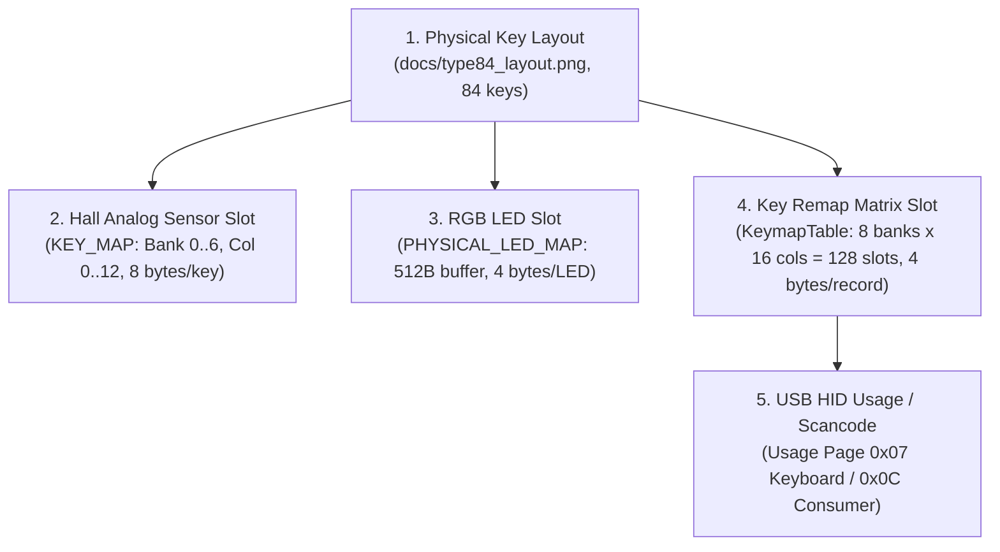

# Key Remapping Protocol (KEYMAP PROTOCOL) Type 84

> **Important Safety Note:**  
> This specification and associated software modules were developed **strictly for passive analysis** of traffic captures.  
> Direct speculative transmission of write commands (`AA 22`, `AA 26`, `AA 2C`) from scripts without verification is **strictly prohibited**.

---

## 1. Layer Architecture

The web configurator reads three independent key remapping tables, each having a fixed size of **512 bytes (128 slots $\times$ 4 bytes)**:

1. **Layer 1 (Base / Default mapping):** Request `AA 12` $\to$ Response `55 12` (10 chunks). Base working layer of the keyboard in Windows mode.
2. **Layer 2 (Fn layer mapping):** Request `AA 16` $\to$ Response `55 16` (10 chunks). Combination layer active when holding the `Fn` key.
3. **Layer 3 (Alternate / Mac mapping):** Request `AA 1C` $\to$ Response `55 1C` (10 chunks). Alternate layout profile (Mac mode or secondary Fn layer).

Each table is transferred via a sequence of 10 incoming reports:
- 9 reports of 56 bytes (`sz = 0x38`) at addresses `0x0000`, `0x0038`, `0x0070`, ..., `0x01C0`.
- 1 tail report of 8 bytes (`sz = 0x08`) at address `0x01F8` (504).

---

## 2. Addressing Coordinate Systems

In the Type 84 architecture, **5 distinct coordinate systems** are strictly separated:



| Addressing System | Capacity / Range | Unit / Size | Purpose |
|:---|:---:|:---:|:---|
| **Physical Layout** | 84 physical keys | Geometric coordinates | Physical key layout on ANSI 75% PCB |
| **Hall Matrix (`KEY_MAP`)** | 1008 bytes (84 active slots) | 8 bytes (`bank * 128 + 5 + col * 8`) | Analog actuation and Rapid Trigger thresholds (`AA 27`/`AA 17`) |
| **RGB Matrix (`PHYSICAL_LED_MAP`)** | 512 bytes (128 LED slots) | 4 bytes (`slot * 4`, `[R, G, B, flags]`) | Per-key backlighting (`AA 24`/`AA 14`) |
| **Remap Matrix (`KeymapTable`)** | 512 bytes (128 slots) | 4 bytes (`slot * 4`, `bank * 16 + col`) | Logical scancode matrix table (`AA 12`/`AA 16`) |
| **HID Usage ID** | `0x00` .. `0xE7` | 1-2 bytes | Standard USB HID specification keycodes |

---

## 3. Key Record Format (KeyRemapRecord)

Each entry in the table occupies exactly **4 bytes**:

```text
+----------+----------+----------+---------------+
|  Byte 0  |  Byte 1  |  Byte 2  |    Byte 3     |
|  Prefix  | Scancode | Special  | Function Type |
+----------+----------+----------+---------------+
```

### Field Definitions:
1. **`Byte 0` (Prefix / Extended Modifier):**
   - Typically `0x00`.
   - In extended records, stores prefix or modifier flags (e.g., `0x92`, `0x56`).
2. **`Byte 1` (Scancode):**
   - Standard USB HID Usage ID from **Keyboard/Keypad Page `0x07`**.
   - Examples: `0x04` = 'A', `0x16` = 'S', `0x29` = 'Escape', `0x28` = 'Enter', `0x39` = 'CapsLock'.
   - Proprietary vendor Fn key scancode: **`0xAF`**.
3. **`Byte 2` (Special / Secondary Code):**
   - Auxiliary function code for hardware and media shortcuts.
   - Used on Layer 2 (`Fn`): e.g., arrow keys `Left` (`0x10`), `Down` (`0x0E`), `Up` (`0x0D`), `Right` (`0x0F`) for lighting control.
4. **`Byte 3` (Function Type):**
   - `0x02` = **Standard Keyboard HID Key**.
   - `0x03` = **Extended System Key** (system key / keypad, e.g., PageDown `0x4E`, KPEnter `0x58`).
   - `0x0D` = **Hardware / Media / RGB Shortcut** (hardware effect/brightness/media toggle).
   - `0x00` = **Unbound / Passthrough** (no binding / passthrough to base layer).

---

## 4. Remap Layer 1 Matrix Map (`AA 12`)

The controller operates on an **8 banks $\times$ 16 columns = 128 slots** matrix grid. Firmware includes Numpad matrix lines for codebase unification with 104-key models.

### Relationship Between Hall Column and Remap Column:
For alphanumeric keys, an exact formula holds:
$$\text{Remap Column} = \text{Hall Column} + 1$$
Column 0 of the Remap matrix is reserved for Numpad / service lines.

### Summary Map of Layer 1 Banks:
* **Bank 0 (Function Row):**
  * `Col 1`: Escape (`0x29`)
  * `Col 2..13`: F1 (`0x3A`) .. F12 (`0x45`)
* **Bank 1 (Number Row):**
  * `Col 1`: Grave / Tilde `` `~ `` (`0x35`)
  * `Col 2..11`: '1' (`0x1E`) .. '0' (`0x27`)
  * `Col 13`: '=+' (`0x2E`)
  * `Col 14..15`: Matrix slots NumLock (`0x53`), KPSlash (`0x54`)
* **Bank 2 (QWERTY Row):**
  * `Col 0`: KPAsterisk (`0x55`)
  * `Col 1`: Tab (`0x2B`)
  * `Col 2..9`: 'Q' (`0x14`) .. 'I' (`0x0C`)
  * `Col 11..13`: 'P' (`0x13`), '[{' (`0x2F`), ']}' (`0x30`)
* **Bank 3 (Home Row):**
  * `Col 1`: CapsLock (`0x39`)
  * `Col 2..7`: 'A' (`0x04`) .. 'H' (`0x0B`)
  * `Col 9..13`: 'K' (`0x0E`), 'L' (`0x0F`), ';:' (`0x33`), '\'"' (`0x34`), '\\|' (`0x31`)
* **Bank 4 (Shift Row):**
  * `Col 1`: LShift (`0xE1`)
  * `Col 2..5`: 'Z' (`0x1D`) .. 'V' (`0x19`)
  * `Col 7..13`: 'N' (`0x11`), 'M' (`0x10`), ',<' (`0x36`), '.>' (`0x37`), '/?' (`0x38`), RShift (`0xE5`), Enter (`0x28`)
* **Bank 5 (Bottom Row & Navigation):**
  * `Col 1..3`: LCtrl (`0xE0`), LGui (`0xE3`), LAlt (`0xE2`)
  * `Col 5..8`: RAlt (`0xE6`), Fn (`0xAF`), Menu (`0x65`), RCtrl (`0xE4`)
  * `Col 9..12`: LeftArrow (`0x50`), DownArrow (`0x51`), UpArrow (`0x52`), RightArrow (`0x4F`)
  * `Col 13`: Backspace (`0x2A`)
* **Bank 6 (Navigation Cluster & Extended):**
  * `Col 4..6`: PrintScreen (`0x46`), ScrollLock (`0x47`), RGui (`0xE7`)
  * `Col 7..13`: Pause (`0x48`), Insert (`0x49`), Home (`0x4A`), PageUp (`0x4B`), Delete (`0x4C`), End (`0x4D`), PageDown (`0x4E`)
* **Bank 7 (Terminator / Reserved):**
  * `Col 0..13`: `00 00 00 00` (empty slots).
  * `Col 14 (Slot 126)`: `00 01 00 00` — table active marker (analogous to marker at end of RGB buffer).

---

## 5. Fn Combination Layer (Layer 2, `AA 16`)

On the `Fn` layer, firmware overrides key behaviors:
1. **Function Row F1..F12:**
   * In table `AA 16`, slots F1..F12 are populated with `00 00 00 00`. The controller applies base key behavior or system passthrough.
2. **Service Shortcuts:**
   * `Fn + Backspace` (Slot 93): Remapped to **ScrollLock** (`0x47`, type `0x02`).
   * `Fn + End` (Slot 108): Remapped to **Pause** (`0x48`, type `0x02`).
3. **Arrow Keys (RGB & Hardware Control):**
   * `Fn + Left` (Slot 89): `special = 0x10`, `type = 0x0D` (RGB direction/mode toggle).
   * `Fn + Down` (Slot 90): `special = 0x0E`, `type = 0x0D` (brightness decrease).
   * `Fn + Up` (Slot 91): `special = 0x0D`, `type = 0x0D` (brightness increase).
   * `Fn + Right` (Slot 92): `special = 0x0F`, `type = 0x02` (speed/color toggle).

---

## 6. Hardware-Verified Write Protocol Remap L1 (`AA 22`)

In a controlled physical test using the official configurator `web.io.vision` (remapping `Key A -> B`, capture file [`captures/experiments/remap_write_a_to_b.json`](file:///c:/KeyboardSoft/captures/experiments/remap_write_a_to_b.json)), exact WRITE transaction parameters were established:

### 6.1. Framing Parameters
| Parameter | Value | Status | Notes |
|:---|:---:|:---:|:---|
| **WRITE Opcode** | **`AA 22`** | **`CONFIRMED`** | Host prefix `0xAA`, operation code `0x22` |
| **Report Length** | **64 bytes** | **`CONFIRMED`** | Standard fixed USB HID OUTPUT report size |
| **Report ID** | **`0`** | **`CONFIRMED`** | WebHID call `sendReport(0, ...)`; no report ID in buffer |
| **Interface** | `0xFF68` / `0x0061` | **`CONFIRMED`** | Primary configuration interface |
| **Chunk Count** | **10 chunks** | **`CONFIRMED`** | 9 chunks $\times$ 56B + 1 tail chunk $\times$ 8B = 512 bytes |
| **Transmission Order** | Linearly ascending | **`CONFIRMED`** | Addresses `0, 56, 112, 168, 224, 280, 336, 392, 448, 504` |
| **Dedicated Commit Terminator** | **NONE** | **`CONFIRMED`** | No 11th packet; committed in-band at chunk #9 (`00 01 00 00`) |
| **Acknowledgments (ACKs)** | **10 reports (`55 22`)** | **`CONFIRMED`** | Controller immediately responds with echo report for each chunk |
| **Inter-packet timing** | ~18..20 ms (avg 19.1 ms) | **`CONFIRMED`** | Total write transaction completes in 188.9 ms |

### 6.2. Data Chunk Structure
```text
Bytes:  0    1    2    3    4    5 .. (5 + len - 1)    (5 + len) .. 63
       AA   22   SZ   A_LO A_HI  [---- PAYLOAD ----]   00 00 00 ...
```
- `SZ`: Payload length (`0x38` = 56 bytes for chunks 0..8; `0x08` = 8 bytes for chunk 9).
- `A_LO`, `A_HI`: 16-bit offset address in Little-Endian format (`<H`).
- Unused tail bytes up to report length (64) are zero-filled (`0x00`).

### 6.3. Controller Acknowledgment Format (ACK)
```text
Bytes:  0    1    2    3    4    5 .. 63
       55   22   SZ   A_LO A_HI  [Payload echo / zeros]
```
For every chunk transmitted, the controller sends an `inputreport` with prefix `0x55` and opcode `0x22`.

### 6.4. Key A Slot Semantic Verification
- Key `A` is mapped to **Slot 50** (Bank 3, Col 2 in Remap matrix, buffer offset `0x00C8` = 200).
- This slot is transferred in **Chunk #3** (address `0x00A8` = 168, offset within chunk `+32`).
- Baseline value: `00 04 00 02` (USB HID Scancode `0x04` = 'A').
- Written value: `00 05 00 02` (USB HID Scancode `0x05` = 'B').
- Byte `0x00C9` changed from `0x04` to `0x05`. Mutation is 100% verified.
- Across all 84 physical keys, no other key was altered.
- Reverting `B -> A` and executing hardware read-back produced a bit-for-bit identical zero-diff state.

---

## 7. Research Status Classification

| Protocol Element | Status | Evidence Base |
|:---|:---:|:---|
| 4-byte record format `[prefix, scancode, special, type]` | **`CONFIRMED`** | 100% match with HID Usage Table Page 0x07 in `read_01_initial_load.json` |
| Table length (512 bytes / 128 slots) | **`CONFIRMED`** | 10 reports (9 $\times$ 56B + 8B) in `AA 12`, `AA 16`, `AA 1C` |
| Alphanumeric key mapping | **`CONFIRMED`** | Direct verification across all 128 slots, verified in unit tests |
| Fn key scancode (`0xAF`) | **`CONFIRMED`** | Verified in Bank 5, Col 6 (Slot 86) |
| Arrow keys behavior on Fn layer (type `0x0D`) | **`CONFIRMED`** | Verified in `AA 16` across slots 89..92 |
| **WRITE Opcode Layer 1 (`AA 22`)** | **`CONFIRMED`** | Verified in `captures/experiments/remap_write_a_to_b.json` |
| **Write Framing (10 chunks, no terminator)** | **`CONFIRMED`** | 10 reports HOST $\to$ DEVICE, 10 synchronous ACKs `55 22` |
| **Key A Slot (Slot 50, address 200)** | **`CONFIRMED`** | Alteration `0x04` $\to$ `0x05` in official capture |
| Role of table `AA 1C` as Layer 3 (Mac/Alt layer) | **`PROBABLE`** | Byte-for-byte structural identity with `AA 16` (512B, 10 chunks) |
| User macro invocation via remap keys | **`PROBABLE`** | Requires targeted capture with bound macro |
