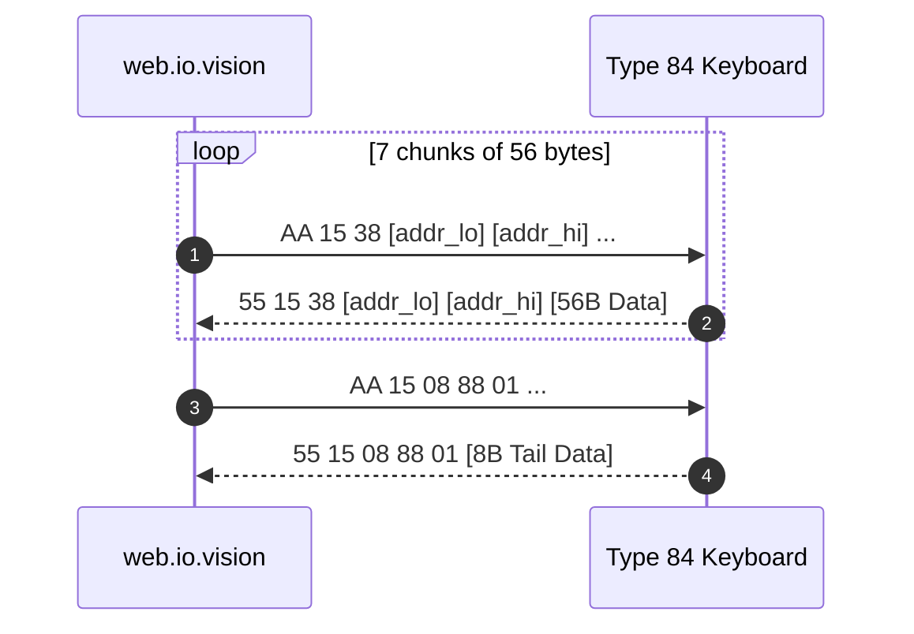

# Macro and DKS Protocol (MACRO / DKS PROTOCOL) Type 84

> **Important Safety Note:**  
> This document and the module [`src/keyboard_re/protocol/macro.py`](file:///c:/KeyboardSoft/src/keyboard_re/protocol/macro.py) are intended **strictly for passive analysis**.  
> Direct speculative transmission of macro write commands to the keyboard without verification is prohibited.

---

## 1. Transport Structure of Macro Buffer (`AA 15` $\leftrightarrow$ `55 15`)

The macro and DKS (Dynamic Keystroke) table is read by the web configurator using command **`AA 15`**:
- **Total Table Size:** **400 bytes** (`0x0190`).
- **Packet Count:** Exactly **8 incoming reports**:
  - 7 packets of 56 bytes (`sz = 0x38`):
    - Chunk 0: address `0x0000` (bytes `0..55`)
    - Chunk 1: address `0x0038` (bytes `56..111`)
    - Chunk 2: address `0x0070` (bytes `112..167`)
    - Chunk 3: address `0x00A8` (bytes `168..223`)
    - Chunk 4: address `0x00E0` (bytes `224..279`)
    - Chunk 5: address `0x0118` (bytes `280..335`)
    - Chunk 6: address `0x0150` (bytes `336..391`)
  - 1 tail packet of 8 bytes (`sz = 0x08`):
    - Chunk 7: address `0x0188` (bytes `392..399`)



---

## 2. Baseline State Analysis (Baseline Capture)

In captured sessions [`read_01_initial_load.json`](file:///c:/KeyboardSoft/captures/experiments/read_01_initial_load.json) and [`read_03_reconnect.json`](file:///c:/KeyboardSoft/captures/experiments/read_03_reconnect.json):
- Macro payload bytes from address `0x0000` to `0x0187` (392 bytes) are strictly populated with **`0x00`**.
- In the tail block at offset **`0x0189`**, byte **`0x01`** is present:
  ```text
  Offset 0x0188: 00 01 00 00 00 00 00 00
  ```
  This byte represents an initialization flag / macro table version evaluated by the controller.

---

## 3. Macro Internal Organization

Based on the 400-byte catalog buffer plus subsequent dynamic heap (as detailed in [`docs/macro_physical_validation_report.md`](file:///c:/KeyboardSoft/docs/macro_physical_validation_report.md)):
1. **Catalog vs Heap Architecture:**
   - Catalog: 100 slots $\times$ 4-byte `uint32_le` pointers located from offset `0x0000` to `0x018F` (400 bytes).
   - Dynamic heap starts at address `0x0190` (400).
2. **Action Record Encoding:**
   - Header: 4-byte header `[f & 0xFF, (f >> 8) & 0xFF, 0x00, 0x00]` where $f = 2 \times \text{action\_count}$.
   - Action entries: 4 bytes each `[delay uint16_le, keycode uint8, flags uint8]`.

---

## 4. Research Status Classification

| Element | Status | Evidence Base |
|:---|:---:|:---|
| Macro read opcode `AA 15` / `55 15` | **`CONFIRMED`** | 8 request-response pairs in real capture sessions |
| Catalog buffer size (400 bytes: 7 $\times$ 56B + 8B) | **`CONFIRMED`** | Addressing and chunk lengths verified in golden tests |
| Buffer initialization flag at offset `0x0189` | **`CONFIRMED`** | Byte `0x01` in dump `read_01_initial_load.json` |
| Empty baseline state without user macros | **`CONFIRMED`** | All 392 catalog bytes equal `0x00` |
| Wire write sequence (`AA 25`) and heap structure | **`CONFIRMED`** | Fully verified on physical hardware via ABA testing |
| DKS (Dynamic Keystroke) multi-threshold matrix | **`CONFIRMED`** | Documented and verified in `AA 18` / `AA 28` subsystems |
