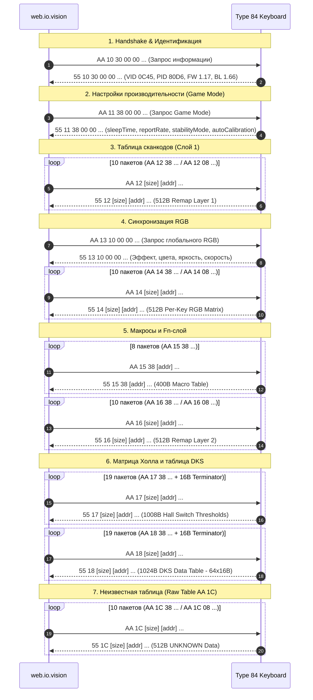

# Протокол чтения и синхронизации состояния (READ / STATE SYNC) Type 84

> **Важное примечание по безопасности:**  
> Данный документ и связанный инструментарий предназначены **исключительно для пассивного наблюдения** за сессиями официального веб-конфигуратора `https://web.io.vision/`.  
> Прямая отправка команд опроса или чтения из Python **не производится**.

---

## 1. Резюме архитектуры State Sync

Исследование реального WebHID-трафика между веб-конфигуратором `https://web.io.vision/` и клавиатурой *IO by Red Square Type 84 Magnetic Black* (VID `0x0C45`, PID `0x80D6`) выявило строгую симметричную клиент-серверную модель обмена "Запрос — Ответ".

### Ключевые архитектурные параметры:
- **Физический канал:** Vendor-Defined HID коллекция **Usage Page `0xFF68`, Usage `0x0061`**.
- **Длина отчёта:** Строго **64 байта** во всех направлениях.
- **Report ID:** Строго **0x00** (без префиксного байта ID в HID-репорте).
- **Механизм опроса:** Хост отправляет `device.sendReport(0, data)`, устройство отвечает через асинхронное событие **`device.oninputreport`**.
- **`receiveFeatureReport`**: **НЕ используется** (0 вызовов за всю сессию).
- **Симметрия префиксов:**
  - **HOST $\to$ DEVICE (Запрос на чтение):** `AA 1x ...`
  - **DEVICE $\to$ HOST (Ответ с данными):** `55 1x ...`
  - **HOST $\to$ DEVICE (Команда записи):** `AA 2x ...`
  - **DEVICE $\to$ HOST (Подтверждение записи / ACK):** `55 2x ...`
- **Задержка ответа (Latency):**
  - Ответ на чтение (`55 1x`): **3 – 6 мс**.
  - ACK на запись (`55 2x`): **18 – 19 мс** (время на фиксацию во Flash-памяти контроллера).

---

## 2. Анализ поведения среды браузера и WebHID API

### 2.1. Сброс сниффера при перезагрузке страницы (`F5`)
В сценарии B при нажатии `F5` или перезагрузке вкладки браузер полностью уничтожает текущий Execution Context (JS-окружение). Перехваченные в DevTools Console функции `navigator.hid.requestDevice`, `device.open` и `device.sendReport` сбрасываются обратно к нативным реализациям браузера.
- **Решение:** Сниффер должен внедряться до исполнения скриптов страницы (например, через расширение браузера Chrome / Violentmonkey / Userscript с директивой `@run-at document-start`), либо данные захватываются при повторном сопряжении (Сценарии A и C).
- **Полнота данных:** Сценарии A (`read_01_initial_load.json`) и C (`read_03_reconnect.json`) содержат идентичный полный цикл инициализации от `deviceOpen` до последнего байта калибровки (ровно 179 событий, 89 пар "запрос-ответ"), что полностью компенсирует отсутствие отдельного дампа перезагрузки.

### 2.2. Повторный выбор клавиатуры при переподключении кабеля
В сценарии C при отключении USB-кабеля экземпляр `HIDDevice` в Chromium переходит в состояние `disconnected` и уничтожается. В соответствии с моделью безопасности WebHID API:
- Chromium не позволяет веб-странице автоматически и скрытно открывать вновь появившиеся USB-устройства без явного жеста пользователя (User Gesture), если сайт не настроил глобальный обработчик `navigator.hid.addEventListener('connect')` с ранее выданными разрешениями.
- Поэтому веб-конфигуратор запрашивает ручное нажатие кнопки подключения и выбор устройства из списка разрешённых.

---

## 3. Матрица команд и опкодов протокола (The Opcode Matrix)

Старший полубайт второго байта пакета определяет направление и тип операции:
- `1` = **READ / QUERY** (Запрос состояния хостом, ответ устройства с данными).
- `2` = **WRITE / COMMIT** (Запись параметров хостом, ответ устройства подтверждением ACK).

Младший полубайт указывает функциональную подсистему контроллера:

| Младший полубайт | Опкод запроса | Опкод ответа | Назначение подсистемы | Объём данных | Формат / Чанки |
|:---:|:---:|:---:|:---|:---:|:---|
| **`0`** | `AA 10` | `55 10` | **Handshake & Device Info** | 16 байт | 1 репорт: VID, PID, FW, BL, Chip ID |
| **`1`** | `AA 11` | `55 11` | **Game Mode & Performance Settings** | 16 байт | 1 репорт: sleepTime, reportRate, stabilityMode, autoCalibration |
| **`2`** | `AA 12` | `55 12` | **Key Remap Table Layer 1** | 512 байт | 10 чанков (9 $\times$ 56Б + 1 $\times$ 8Б) |
| **`3`** | `AA 13` | `55 13` | **Global RGB Configuration** | 24 байта | 1 репорт: режим, цвета, яркость, скорость |
| **`4`** | `AA 14` | `55 14` | **Per-Key RGB Matrix Read** | 512 байт | 10 чанков (9 $\times$ 56Б + 1 $\times$ 8Б) |
| **`5`** | `AA 15` | `55 15` | **Macro Table Read** | 400 байт | 8 чанков (7 $\times$ 56Б + 1 $\times$ 8Б) |
| **`6`** | `AA 16` | `55 16` | **Key Remap Table Layer 2 (Fn)** | 512 байт | 10 чанков (Fn-слой сканкодов) |
| **`7`** | `AA 17` | `55 17` | **Hall Matrix Read (Switch Thresholds)** | 1008 байт | 18 чанков по 56Б + 1 терминатор (16Б) |
| **`8`** | `AA 18` | `55 18` | **DKS Data Table (64 slots $\times$ 16B)** | 1024 байта | 18 чанков по 56Б + 1 чанк по 16Б |
| **`C`** | `AA 1C` | `55 1C` | **Layer 3 Raw Table (UNKNOWN semantics)** | 512 байт | 10 чанков (9 $\times$ 56Б + 1 $\times$ 8Б) |

---

## 4. Детальная спецификация форматов пакетов

### 4.1. Handshake & Device Info (`AA 10` $\leftrightarrow$ `55 10`)

**Запрос хоста (64 байта):**
```text
Offset 00: AA 10 30 00 00 00 01 00 [00 ... 00]
```
- `AA 10`: Опкод запроса информации об устройстве.
- `30`: Размер запрашиваемых метаданных (48 байт).

**Ответ клавиатуры (64 байта):**
```text
Offset 00: 55 10 30 00 00 00 01 00 00 00 00 92 45 0C D6 80 17 01 00 00 66 01 ...
```
- `[0..2]`: Префикс `55 10 30`.
- `[3..7]`: Подзаголовок `00 00 00 01 00`.
- `[8..11]`: Chip ID / Аппаратная ревизия (`00 00 00 92`).
- `[12..13]`: Vendor ID (uint16_le) = `0x0C45` (Sonix Technology).
- `[14..15]`: Product ID (uint16_le) = `0x80D6`.
- `[16..17]`: Firmware Version (BCD uint16_le) = `0x0117` $\to$ **v1.17**.
- `[20..21]`: Bootloader Version (BCD uint16_le) = `0x0166` $\to$ **v1.66**.

### 4.2. Game Mode & Performance Settings (`AA 11` $\leftrightarrow$ `55 11`)

**Запрос хоста:**
```text
Offset 00: AA 11 38 00 00 00 01 00 [00 ... 00]
```

**Ответ клавиатуры:**
```text
Offset 00: 55 11 38 00 00 00 01 00 00 00 00 01 00 06 00 00 00 00 00 01 00 00 01 00 ...
```
- Байт `11` (`r[3]`): **`sleepTime`** (`0x01` = таймаут ухода в сон 1 минута; ранее ошибочно принимался за Active Profile).
- Байт `13` (`r[5]`): **`reportRate`** (`0x06` = 8000 Hz; ранее принимался за Lock Flags).
- Байт `19` (`r[11]`): **`stabilityMode`** (`0x01` = режим стабильности включён).
- Байт `22` (`r[14]`): **`autoCalibration`** (`0x01` = автокалибровка включена).
- Байты `8..23`: Сырой 16-байтовый буфер параметров производительности (`raw_payload`).

### 4.3. Global RGB State (`AA 13` $\leftrightarrow$ `55 13`)

Полная симметрия с протоколом записи [`AA 23`](file:///c:/KeyboardSoft/docs/RGB_PROTOCOL.md):
- Запрос хоста: `AA 13 10 00 00 00 01 00 ...` (запрос 16 байт RGB-параметров).
- Ответ устройства:
  ```text
  Offset 00: 55 13 10 00 00 00 01 00 0F FF FF FF 00 00 00 00 01 05 05 00 00 00 00 00 ...
  ```
  - Байт `8`: Режим подсветки (`0x0F` = 15 = Custom RGB).
  - Байты `9..11`: Основной цвет RGB (`FF FF FF` = белый).
  - Байты `12..14`: Дополнительный цвет RGB (`00 00 00`).
  - Байт `17`: Яркость (1..5).
  - Байт `18`: Скорость эффекта (1..5).

### 4.4. Per-Key RGB Matrix (`AA 14` $\leftrightarrow$ `55 14`)

Полная симметрия с протоколом записи [`AA 24`](file:///c:/KeyboardSoft/docs/RGB_PROTOCOL.md):
- Хост запрашивает 512-байтный буфер светодиодов последовательностью из 10 запросов:
  - 9 запросов с размером `0x38` (56 байт) по смещениям `0x0000`, `0x0038`, `0x0070`, ..., `0x01C0`.
  - 1 финальный запрос с размером `0x08` (8 байт) по смещению `0x01F8` (504).
- Устройство отвечает 10 отчётами `55 14 38 ...` и `55 14 08 ...`, которые парсер [`parse_rgb_per_key_read_chunks`](file:///c:/KeyboardSoft/src/keyboard_re/protocol/read.py) собирает в единый 512-байтный массив.

### 4.5. Hall Effect Key Matrix (`AA 17` $\leftrightarrow$ `55 17`)

Полная симметрия с протоколом записи [`AA 27`](file:///c:/KeyboardSoft/docs/PROTOCOL.md):
- Хост вычитывает 1008-байтный конфигурационный образ свитчей:
  - 18 запросов с размером `0x38` (56 байт) по адресам от `0x0000` до `0x03B8` с шагом 56.
  - 1 запрос терминатора с размером `0x10` (16 байт) по адресу `0x03F0` (1008).
- Устройство отвечает соответствующими отчётами `55 17 38 ...` и терминатором `55 17 10 ...`.
- Результирующий 1008-байтный образ декодируется существующей функцией [`parse_hall_read_chunks`](file:///c:/KeyboardSoft/src/keyboard_re/protocol/read.py). В декодированном образе обнаруживаются ровно 84 сконфигурированные клавиши в полном соответствии с формулой адресации `bank * 128 + 5 + column * 8`.

### 4.6. DKS Data Table (`AA 18` $\leftrightarrow$ `55 18`)

Считывание конфигурации Dynamic Keystroke (DKS) объёмом ровно 1024 байта (64 слота по 16 байт):
- Хост запрашивает 1024-байтный буфер серией из 19 запросов:
  - 18 запросов с размером `0x38` (56 байт) по адресам от `0x0000` до `0x03B8` с шагом 56 (`AA 18 38 <addr_lo> <addr_hi> ...`).
  - 1 запрос терминатора с размером `0x10` (16 байт) по адресу `0x03F0` (1008) (`AA 18 10 F0 03 ...`).
- Устройство отвечает отчётами `55 18 38 ...` и терминатором `55 18 10 ...`.
- Результирующий 1024-байтный образ декодируется функцией [`parse_dks_read_chunks`](file:///c:/KeyboardSoft/src/keyboard_re/protocol/read.py).
- *Примечание:* Ранее в проекте данный буфер ошибочно интерпретировался как "Hall Profile 2". В производственном бандле официального конфигуратора (`Ve.GET_MAGNETIC_AXIS_DKS_DATA`) доказано, что это таблица DKS. В заводском состоянии таблица заполнена нулями. Внутренняя структура 16-байтовой записи DKS классифицирована как `UNKNOWN`, сырой буфер сохраняется 100% byte-exact.

### 4.7. Raw Data Table (`AA 1C` $\leftrightarrow$ `55 1C`)

- Хост вычитывает 512-байтный образ серией из 10 запросов (9 по 56 байт + 1 на 8 байт).
- В официальном бандле опкод `0x1C` обозначен как `GET_DEFAULT_FN_KEY_MATRIX`.
- Семантика данных сохраняется как `UNKNOWN` и буфер хранится в неизменном сыром виде без искусственных интерпретаций.

### 4.8. Write Acknowledgment (`AA 2x` $\to$ `55 2x`)

При сохранении параметров пользователем (Сценарий D):
- Хост отправляет пакет записи: `AA 27 38 <addr_lo> <addr_hi> ...`
- Клавиатура после записи во Flash отвечает через `inputreport`: `55 27 38 <addr_lo> <addr_hi> ...`
- Время подтверждения составляет ~18.4 – 19.5 мс на пакет.

---

## 5. Полная хронология сессии инициализации (Initial Sync Sequence)

Типичный запуск веб-конфигуратора порождает строго детерминированную последовательность из 89 запросов:



---

## 6. Классификация статусов компонентов

| Компонент | Статус | Доказательная база |
|:---|:---:|:---|
| Идентификация контроллера (VID, PID, FW, BL) | **`CONFIRMED`** | Пакеты `AA 10` / `55 10` в `read_01_initial_load.json` и `read_03_reconnect.json` |
| Настройки Game Mode / sleepTime / reportRate (`AA 11`) | **`CONFIRMED`** | Декодирование `Po` (`getGameMode`) из бандла официального конфигуратора |
| Канал передачи (Usage Page 0xFF68, Report ID 0) | **`CONFIRMED`** | WebHID Event stream в обоих направлениях |
| Механизм чтения (`sendReport` + `inputreport`) | **`CONFIRMED`** | 100% сопряжение пар запрос-ответ, 0 `receiveFeatureReport` |
| Чтение глобального RGB (`AA 13` / `55 13`) | **`CONFIRMED`** | Совпадение формата с `AA 23`, верифицировано в golden tests |
| Чтение поклавишного RGB (`AA 14` / `55 14`) | **`CONFIRMED`** | Реконструкция 512B буфера, верифицировано в golden tests |
| Чтение матрицы Холла (`AA 17` / `55 17`) | **`CONFIRMED`** | Реконструкция 1008B образа, 84 клавиши, верифицировано в tests |
| Чтение DKS таблицы (`AA 18` / `55 18`) | **`CONFIRMED`** | 1024B (18 $\times$ 56Б + 1 $\times$ 16Б), 64 слота $\times$ 16Б, верифицировано в tests |
| Подтверждение записи (`AA 27` $\to$ `55 27`) | **`CONFIRMED`** | 19 пар ACK в `read_04_param_change.json` |
| Таблицы сканкодов Layer 1 и Layer 2 (`AA 12`, `AA 16`) | **`CONFIRMED`** | 512B буферы сканкодов (128 слотов по 4Б), проверено в golden tests |
| Буфер макросов (`AA 15`) | **`CONFIRMED`** | 400B буфер (8 чанков), проверено в tests |
| Клиентское хранение профилей (IndexedDB / Host) | **`CONFIRMED`** | Анализ бандла `useProfiles-CdvILL1K.js` (профили хранятся на хосте) |
| Внутренний формат записей DKS (16B) | **`UNKNOWN`** | Данные сохраняются 100% byte-exact без домысливания структуры |
| Семантика таблицы `AA 1C` (512B) | **`UNKNOWN`** | Сырой буфер сохранён byte-exact |
| Аппаратный регистр Active Profile в `55 11` | **`DISPROVED`** | Байт 11 — это `sleepTime` (1 мин), аппаратного регистра профилей нет |
| Второй профиль матрицы Холла (`Hall Profile 2` в `AA 18`) | **`DISPROVED`** | Опкод `AA 18` — это `GET_MAGNETIC_AXIS_DKS_DATA`, а не профиль Холла |
