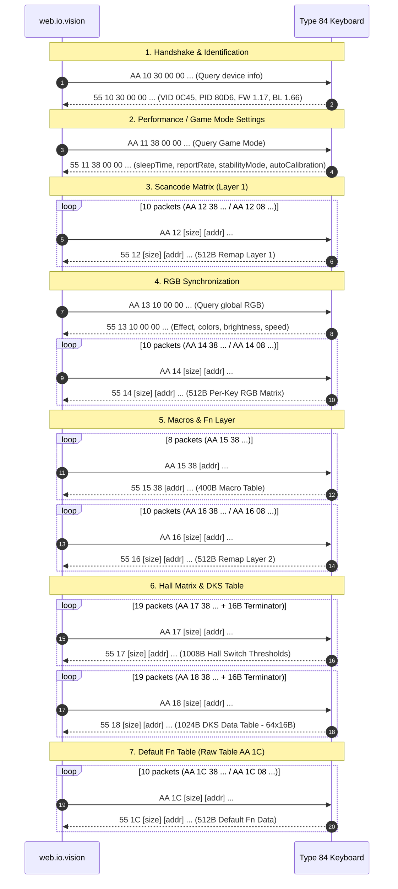

# Read & State Synchronization Protocol (READ / STATE SYNC) Type 84

> **Important Safety Note:**  
> This document and the related tooling are intended **strictly for passive observation** of session traffic from the official web configurator `https://web.io.vision/`.  
> Speculative polling or uncontrolled command injection from scripts without sandbox validation is prohibited.

---

## 1. State Sync Architectural Summary

Analysis of WebHID traffic between the official web configurator `https://web.io.vision/` and the *IO by Red Square Type 84 Magnetic Black* keyboard (VID `0x0C45`, PID `0x80D6`) reveals a strictly symmetrical client-server request-response exchange model.

### Core Architectural Parameters:
- **Physical Channel:** Vendor-Defined HID Collection **Usage Page `0xFF68`, Usage `0x0061`**.
- **Report Length:** Strictly **64 bytes** in both directions.
- **Report ID:** Strictly **0x00** (no prefix ID byte in HID reports).
- **Polling Mechanism:** Host issues `device.sendReport(0, data)`, device responds asynchronously via **`device.oninputreport`**.
- **`receiveFeatureReport`**: **NOT used** (0 invocations throughout all sessions).
- **Prefix Symmetry:**
  - **HOST $\to$ DEVICE (Read / Query Request):** `AA 1x ...`
  - **DEVICE $\to$ HOST (Data Response):** `55 1x ...`
  - **HOST $\to$ DEVICE (Write / Mutation Command):** `AA 2x ...`
  - **DEVICE $\to$ HOST (Write Acknowledgment / ACK):** `55 2x ...`
- **Response Latencies:**
  - Read response (`55 1x`): **3 – 6 ms**.
  - Write ACK (`55 2x`): **18 – 19 ms** (flash commit latency on microcontroller).

---

## 2. Browser Environment & WebHID API Characteristics

### 2.1. Sniffer Reset on Page Refresh (`F5`)
In Scenario B, upon pressing `F5` or refreshing the tab, the browser destroys the current JavaScript Execution Context. Handlers hooked in DevTools Console (`navigator.hid.requestDevice`, `device.open`, `device.sendReport`) revert to native browser implementations.
- **Remedy:** The sniffer must be injected prior to document execution (via browser extension or Userscript with `@run-at document-start`), or captures must be taken upon reconnection (Scenarios A and C).
- **Data Completeness:** Scenarios A (`read_01_initial_load.json`) and C (`read_03_reconnect.json`) capture identical complete initialization lifecycles from `deviceOpen` to the final calibration byte (exactly 179 events, 89 request-response pairs), fully covering initialization dynamics.

### 2.2. Device Re-selection Upon Cable Reconnection
In Scenario C, unplugging the USB cable transitions the Chromium `HIDDevice` instance into a `disconnected` state. In alignment with WebHID security architecture:
- Chromium does not permit web applications to covertly re-open newly enumerated USB devices without an explicit User Gesture, unless configured with a persistent `navigator.hid.addEventListener('connect')` handler.
- The web configurator prompts the user to manually click Connect and re-select the authorized device.

---

## 3. Protocol Command & Opcode Matrix

The high nibble of byte 1 specifies operation type and direction:
- `1` = **READ / QUERY** (Host query, device returns payload).
- `2` = **WRITE / COMMIT** (Host mutation command, device returns ACK).

The low nibble identifies the target subsystem:

| Low Nibble | Request Opcode | Response Opcode | Subsystem Purpose | Data Volume | Framing / Chunks |
|:---:|:---:|:---:|:---|:---:|:---|
| **`0`** | `AA 10` | `55 10` | **Handshake & Device Info** | 16 bytes | 1 report: VID, PID, FW, BL, Chip ID |
| **`1`** | `AA 11` | `55 11` | **Game Mode & Performance Settings** | 16 bytes | 1 report: sleepTime, reportRate, stabilityMode, autoCalibration |
| **`2`** | `AA 12` | `55 12` | **Key Remap Table Layer 1** | 512 bytes | 10 chunks (9 $\times$ 56B + 1 $\times$ 8B) |
| **`3`** | `AA 13` | `55 13` | **Global RGB Configuration** | 24 bytes | 1 report: mode, colors, brightness, speed |
| **`4`** | `AA 14` | `55 14` | **Per-Key RGB Matrix Read** | 512 bytes | 10 chunks (9 $\times$ 56B + 1 $\times$ 8B) |
| **`5`** | `AA 15` | `55 15` | **Macro Table Read** | 400 bytes | 8 chunks (7 $\times$ 56B + 1 $\times$ 8B) |
| **`6`** | `AA 16` | `55 16` | **Key Remap Table Layer 2 (Fn)** | 512 bytes | 10 chunks (Fn scancode layer) |
| **`7`** | `AA 17` | `55 17` | **Hall Matrix Read (Switch Thresholds)** | 1008 bytes | 18 chunks $\times$ 56B + 1 terminator (16B) |
| **`8`** | `AA 18` | `55 18` | **DKS Data Table (64 slots $\times$ 16B)** | 1024 bytes | 18 chunks $\times$ 56B + 1 chunk $\times$ 16B |
| **`C`** | `AA 1C` | `55 1C` | **Layer 3 Raw Table (Factory default Fn)** | 512 bytes | 10 chunks (9 $\times$ 56B + 1 $\times$ 8B) |

---

## 4. Packet Format Specifications

### 4.1. Handshake & Device Info (`AA 10` $\leftrightarrow$ `55 10`)

**Host Request (64 bytes):**
```text
Offset 00: AA 10 30 00 00 00 01 00 [00 ... 00]
```
- `AA 10`: Device information query opcode.
- `30`: Requested metadata size (48 bytes).

**Device Response (64 bytes):**
```text
Offset 00: 55 10 30 00 00 00 01 00 00 00 00 92 45 0C D6 80 17 01 00 00 66 01 ...
```
- `[0..2]`: Prefix `55 10 30`.
- `[3..7]`: Subheader `00 00 00 01 00`.
- `[8..11]`: Chip ID / Hardware Revision (`00 00 00 92`).
- `[12..13]`: Vendor ID (uint16_le) = `0x0C45` (Sonix Technology).
- `[14..15]`: Product ID (uint16_le) = `0x80D6`.
- `[16..17]`: Firmware Version (BCD uint16_le) = `0x0117` $\to$ **v1.17**.
- `[20..21]`: Bootloader Version (BCD uint16_le) = `0x0166` $\to$ **v1.66**.

### 4.2. Game Mode & Performance Settings (`AA 11` $\leftrightarrow$ `55 11`)

**Host Request:**
```text
Offset 00: AA 11 38 00 00 00 01 00 [00 ... 00]
```

**Device Response:**
```text
Offset 00: 55 11 38 00 00 00 01 00 00 00 00 01 00 06 00 00 00 00 00 01 00 00 01 00 ...
```
- Byte `11` (`r[3]`): **`sleepTime`** (`0x01` = 1 minute sleep timer; was previously misidentified as Active Profile).
- Byte `13` (`r[5]`): **`reportRate`** (`0x06` = 8000 Hz; was previously misidentified as Lock Flags).
- Byte `19` (`r[11]`): **`stabilityMode`** (`0x01` = stability mode enabled).
- Byte `22` (`r[14]`): **`autoCalibration`** (`0x01` = auto-calibration enabled).
- Bytes `8..23`: Raw 16-byte performance parameter buffer (`raw_payload`).

### 4.3. Global RGB State (`AA 13` $\leftrightarrow$ `55 13`)

Symmetrical with write protocol [`AA 23`](file:///c:/KeyboardSoft/docs/RGB_PROTOCOL.md):
- Host Request: `AA 13 10 00 00 00 01 00 ...` (queries 16 bytes of RGB parameters).
- Device Response:
  ```text
  Offset 00: 55 13 10 00 00 00 01 00 0F FF FF FF 00 00 00 00 01 05 05 00 00 00 00 00 ...
  ```
  - Byte `8`: Lighting mode (`0x0F` = 15 = Custom RGB).
  - Bytes `9..11`: Primary RGB color (`FF FF FF` = white).
  - Bytes `12..14`: Secondary RGB color (`00 00 00`).
  - Byte `17`: Brightness (1..5).
  - Byte `18`: Effect speed (1..5).

### 4.4. Per-Key RGB Matrix (`AA 14` $\leftrightarrow$ `55 14`)

Symmetrical with write protocol [`AA 24`](file:///c:/KeyboardSoft/docs/RGB_PROTOCOL.md):
- Host queries 512-byte LED buffer via 10 requests:
  - 9 requests with size `0x38` (56 bytes) at offsets `0x0000`, `0x0038`, ..., `0x01C0`.
  - 1 final request with size `0x08` (8 bytes) at offset `0x01F8` (504).
- Device returns 10 reports `55 14 38 ...` and `55 14 08 ...`, reassembled by [`parse_rgb_per_key_read_chunks`](file:///c:/KeyboardSoft/src/keyboard_re/protocol/read.py) into a unified 512-byte array.

### 4.5. Hall Effect Key Matrix (`AA 17` $\leftrightarrow$ `55 17`)

Symmetrical with write protocol [`AA 27`](file:///c:/KeyboardSoft/docs/PROTOCOL.md):
- Host reads 1008-byte switch configuration image:
  - 18 requests of size `0x38` (56 bytes) spanning `0x0000` to `0x03B8` in 56-byte steps.
  - 1 terminator request of size `0x10` (16 bytes) at address `0x03F0` (1008).
- Device responds with reports `55 17 38 ...` and terminator `55 17 10 ...`.
- Decoded via [`parse_hall_read_chunks`](file:///c:/KeyboardSoft/src/keyboard_re/protocol/read.py), yielding exactly 84 configured keys matching `bank * 128 + 5 + column * 8`.

### 4.6. DKS Data Table (`AA 18` $\leftrightarrow$ `55 18`)

Reads Dynamic Keystroke (DKS) table of exactly 1024 bytes (64 slots $\times$ 16 bytes):
- Host queries 1024-byte buffer across 19 requests:
  - 18 requests of size `0x38` (56 bytes) from `0x0000` to `0x03B8` (`AA 18 38 <addr_lo> <addr_hi> ...`).
  - 1 terminator request of size `0x10` (16 bytes) at address `0x03F0` (1008) (`AA 18 10 F0 03 ...`).
- Device responds with `55 18 38 ...` reports and terminator `55 18 10 ...`.
- Decoded via [`parse_dks_read_chunks`](file:///c:/KeyboardSoft/src/keyboard_re/protocol/read.py).
- *Note:* In official configurator source (`Ve.GET_MAGNETIC_AXIS_DKS_DATA`), this is proven to be the DKS table (not a secondary Hall profile).

### 4.7. Raw Data Table (`AA 1C` $\leftrightarrow$ `55 1C`)

- Host reads 512-byte image across 10 requests (9 $\times$ 56B + 1 $\times$ 8B).
- In official bundle, opcode `0x1C` is designated `GET_DEFAULT_FN_KEY_MATRIX`.
- Preserved byte-exact without speculative field transformations.

### 4.8. Write Acknowledgment (`AA 2x` $\to$ `55 2x`)

During user configuration save actions (Scenario D):
- Host sends write packet: `AA 27 38 <addr_lo> <addr_hi> ...`
- Following flash write, keyboard acknowledges via `inputreport`: `55 27 38 <addr_lo> <addr_hi> ...`
- Acknowledgment latency is ~18.4 – 19.5 ms per packet.

---

## 5. Initial Synchronization Sequence Chronology

A standard web configurator launch produces a strictly deterministic sequence of 89 requests:



---

## 6. Subsystem Status Classification

| Component | Status | Evidence Base |
|:---|:---:|:---|
| Controller identification (VID, PID, FW, BL) | **`CONFIRMED`** | Packets `AA 10` / `55 10` in `read_01_initial_load.json` and `read_03_reconnect.json` |
| Settings Game Mode / sleepTime / reportRate (`AA 11`) | **`CONFIRMED`** | Disassembly of `Po` (`getGameMode`) in official web configurator bundle |
| Transport channel (Usage Page 0xFF68, Report ID 0) | **`CONFIRMED`** | WebHID Event stream in both directions |
| Read mechanism (`sendReport` + `inputreport`) | **`CONFIRMED`** | 100% paired request-response records, 0 `receiveFeatureReport` |
| Global RGB read (`AA 13` / `55 13`) | **`CONFIRMED`** | Format matches `AA 23`, verified in golden tests |
| Per-Key RGB read (`AA 14` / `55 14`) | **`CONFIRMED`** | Reconstructed 512B buffer, verified in golden tests |
| Hall matrix read (`AA 17` / `55 17`) | **`CONFIRMED`** | Reconstructed 1008B image, 84 keys, verified in unit tests |
| DKS table read (`AA 18` / `55 18`) | **`CONFIRMED`** | 1024B (18 $\times$ 56B + 1 $\times$ 16B), 64 slots $\times$ 16B, verified in unit tests |
| Write acknowledgment (`AA 27` $\to$ `55 27`) | **`CONFIRMED`** | 19 ACK pairs in `read_04_param_change.json` |
| Scancode tables Layer 1 & 2 (`AA 12`, `AA 16`) | **`CONFIRMED`** | 512B scancode buffers (128 slots $\times$ 4B), verified in golden tests |
| Macro buffer (`AA 15`) | **`CONFIRMED`** | 400B buffer (8 chunks), verified in unit tests |
| Client-side profile persistence (IndexedDB / Host) | **`CONFIRMED`** | Verified in `useProfiles-CdvILL1K.js` (profiles reside on host) |
| Internal format of DKS records (16B) | **`UNKNOWN`** | Preserved 100% byte-exact without speculative field transformations |
| Semantics of table `AA 1C` (512B) | **`UNKNOWN`** | Preserved raw byte-exact |
| Hardware Active Profile register in `55 11` | **`DISPROVED`** | Byte 11 is `sleepTime` (1 min); no physical hardware profile register exists |
| Secondary Hall matrix profile (`Hall Profile 2` in `AA 18`) | **`DISPROVED`** | Opcode `AA 18` is `GET_MAGNETIC_AXIS_DKS_DATA`, not a Hall profile |
